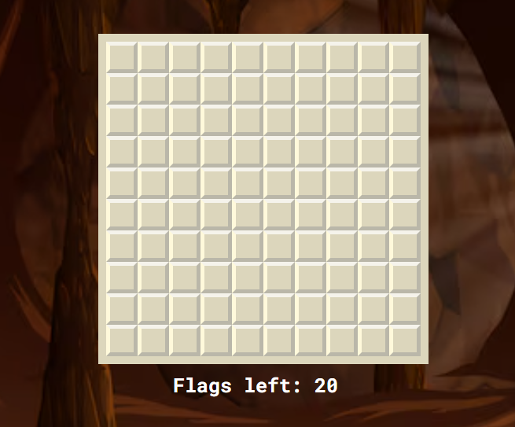

# Minesweeper

this is my first individual project in this hobby in which I'm just starting out

Additional description about the project and its features.

## Built With

- Javascript
- Html5
- css

## Live Demo

[Live Demo Link](https://manuelleon123.github.io/minesweeper-project/)

## Getting Started

**go to the github to search for the game and go to where it says go live once there just enjoy..**

To get a local copy up and running follow these simple example steps.

### Prerequisites

### Setup

### Install

### Usage

### Run tests

### Deployment

## Authors

👤 **Manuel Jesus Leon Cairos**

## 🤝 Contributing

Contributions, issues, and feature requests are welcome!

Feel free to check the [issues page](https://github.com/Manuelleon123/minesweeper-project/issues).

## Show your support

Give a ⭐️ if you like this project!

## Acknowledgments

Google

## 📝 License

This project is [CC0 1.0 Universal](LICENSE) licensed.